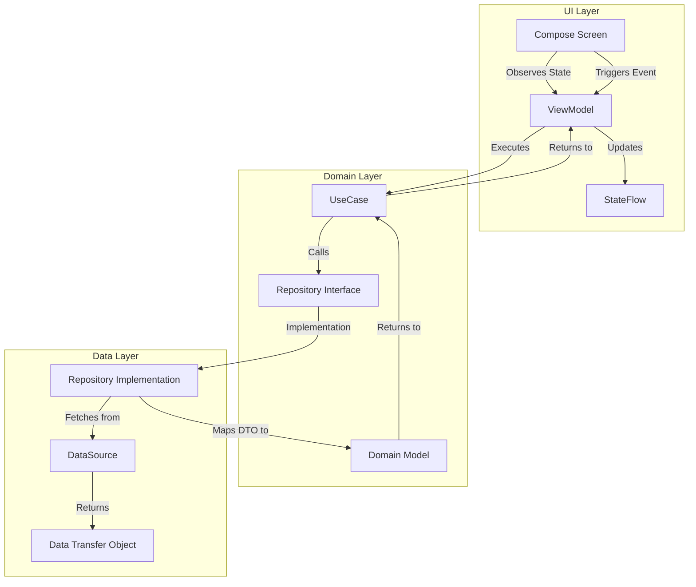
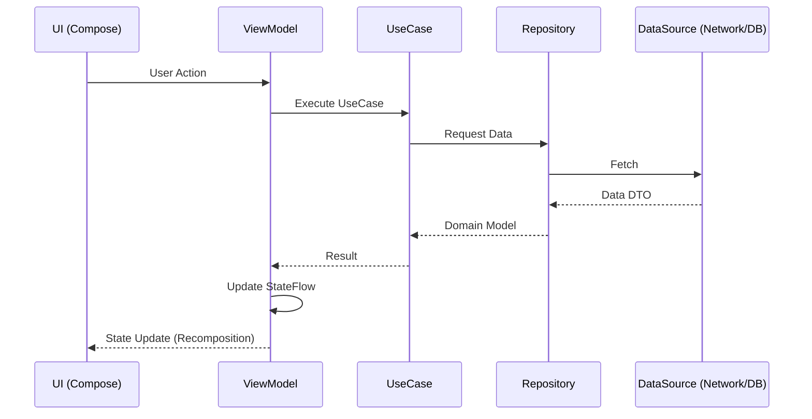

# Architecture Exploration

This project is an exploration of modern Android architecture, showcasing a highly modularized setup using Clean Architecture, MVVM, and Jetpack Compose.

## 🏗 Architecture Overview

The project follows the principles of **Clean Architecture** combined with the **MVVM (Model-View-ViewModel)** pattern. It is designed to be scalable, testable, and maintainable through strict separation of concerns and a clear modularization strategy.

### Core Principles
- **Separation of Concerns**: Each module and layer has a single, well-defined responsibility.
- **Dependency Rule**: Dependencies point inwards. Outer layers (UI, Data) depend on the inner layer (Domain).
- **Reactive State Management**: Using `StateFlow` and `SharedFlow` for a unidirectional data flow.
- **Type-safe Navigation**: Leveraging Compose Navigation with Kotlin Serialization for type-safe routing.
- **Modularization by Feature**: Each functional area of the app is encapsulated in its own set of modules.
- **Convention over Configuration**: Using Custom Gradle Convention Plugins (`buildSrc`) to share build logic across modules.

---

## 📦 Modularization Strategy

The project is divided into three main types of modules:

1.  **App Module (`:app`)**: The entry point of the application. It handles global DI configuration and orchestrates high-level navigation.
2.  **Feature Modules (`:feature:*`)**: Each feature is further subdivided into specialized modules to enforce boundaries.
3.  **Core Modules (`:core:*`)**: Shared libraries and utilities used across multiple features (e.g., `:core:ui`, `:core:network`, `:core:data`).

### Feature Module Structure
Each feature (e.g., `home`, `profile`) is ideally split into:
-   **`:feature:*:api`**: Public interface of the feature. Contains routes and provider interfaces. Other modules only depend on this.
-   **`:feature:*:domain`**: Pure Kotlin module containing business logic, models, and repository interfaces.
-   **`:feature:*:data`**: Implementation of repository interfaces, data sources (API/Local), and data mapping.
-   **`:feature:*:ui`**: Jetpack Compose implementation of the feature's screens and components.
-   **`:feature:*`**: The "orchestrator" module. It contains Koin DI modules and ties the other sub-modules together.

### Module Dependency Diagram

```mermaid
graph TD
    App[":app"]
    CoreUI[":core:ui"]
    CoreNetwork[":core:network"]
    CoreData[":core:data"]
    
    subgraph Vehicle Feature
        FeatureVehicle[":feature:vehicle"]
        FeatureVehicleApi[":feature:vehicle:api"]
        FeatureVehicleUI[":feature:vehicle:ui"]
        FeatureVehicleDomain[":feature:vehicle:domain"]
        FeatureVehicleData[":feature:vehicle:data"]
    end

    subgraph Sub Features (API only)
        FeatureRangeApi[":feature:range:api"]
        FeatureClimatisationApi[":feature:climatisation:api"]
        FeatureAccessApi[":feature:access:api"]
    end

    App --> FeatureVehicle
    App --> FeatureVehicleApi
    App --> CoreUI
    
    FeatureVehicle --> FeatureVehicleApi
    FeatureVehicle --> FeatureVehicleUI
    FeatureVehicle --> FeatureVehicleDomain
    FeatureVehicle --> FeatureVehicleData
    
    FeatureVehicleUI --> FeatureVehicleApi
    FeatureVehicleUI --> FeatureVehicleDomain
    FeatureVehicleUI --> CoreUI
    FeatureVehicleUI --> FeatureRangeApi
    FeatureVehicleUI --> FeatureClimatisationApi
    FeatureVehicleUI --> FeatureAccessApi
    
    FeatureVehicleData --> FeatureVehicleDomain
    FeatureVehicleData --> CoreData
    FeatureVehicleData --> CoreNetwork
    
    FeatureVehicleDomain -->|Interfaces/Models| CoreData
```

---

## 🛠 Tech Stack

-   **Language**: [Kotlin](https://kotlinlang.org/)
-   **UI Framework**: [Jetpack Compose](https://developer.android.com/jetpack/compose)
-   **Dependency Injection**: [Koin](https://insert-koin.io/)
-   **Navigation**: [Compose Navigation](https://developer.android.com/jetpack/compose/navigation)
-   **Networking**: [Retrofit](https://square.github.io/retrofit/) & [OkHttp](https://square.github.io/okhttp/)
-   **Serialization**: [Kotlinx Serialization](https://github.com/Kotlin/kotlinx.serialization)
-   **Asynchronous Programming**: [Coroutines](https://kotlinlang.org/docs/coroutines-overview.html) & [Flow](https://kotlinlang.org/docs/flow.html)
-   **Architecture**: MVVM + Clean Architecture

---

## 🔄 Data Flow

The application follows a Unidirectional Data Flow (UDF) pattern:

1.  **UI** triggers an event (e.g., User clicks a button).
2.  **ViewModel** receives the event and calls a **UseCase**.
3.  **UseCase** interacts with one or more **Repositories**.
4.  **Repository** fetches data from a **DataSource** (Remote or Local).
5.  Data flows back up through the layers, being mapped to Domain models.
6.  **ViewModel** updates the **StateFlow**.
7.  **UI** observes the state and re-composes.

### MVVM + Clean Architecture Layers



### Sequence Diagram



---

## 💉 Dependency Injection

Koin is used for dependency injection. Each feature defines its own `KoinModule`, which is then included in the main `AppModule`.

-   **Feature modules** provide their implementations (e.g., `single<HomeRepository> { HomeRepositoryImpl(get()) }`).
-   **API modules** define the interfaces that are injected into other modules.
-   The **App module** acts as the composition root.

---

## 🗺 Navigation

Navigation is implemented using **Compose Navigation** with type-safe routes.

-   Routes are defined as `@Serializable` objects or classes in the `:api` modules.
-   Features expose their screens via a `Provider` interface and a `NavGraphBuilder` extension function.
-   The `:app` module coordinates the `NavHost` and manages the bottom navigation or navigation drawer.

---

## 🧪 Testing

-   **Unit Tests**: Located in `test` folders. Used for ViewModels, UseCases, and Repositories.
-   **UI Tests**: Located in `androidTest` folders. Used for Compose screens and components using `ComposeTestRule`.
-   **Mocking**: [MockK](https://mockk.io/) is used for mocking dependencies in tests.
